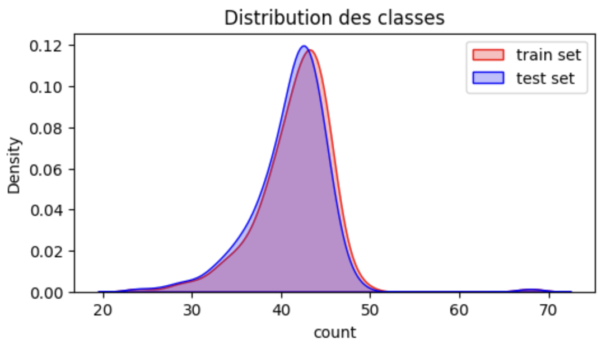
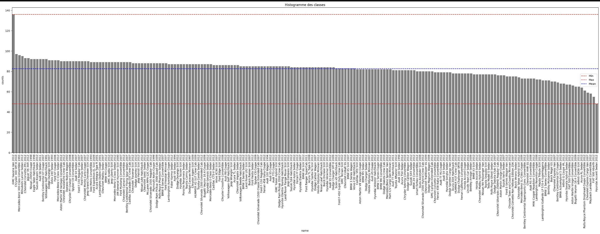
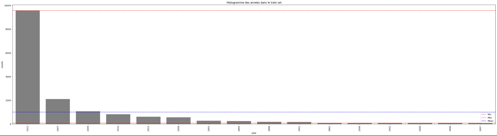
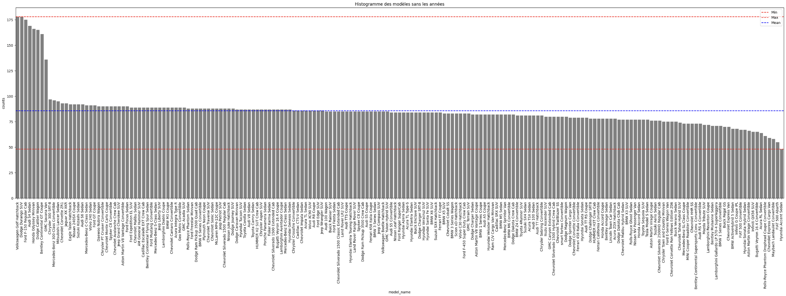
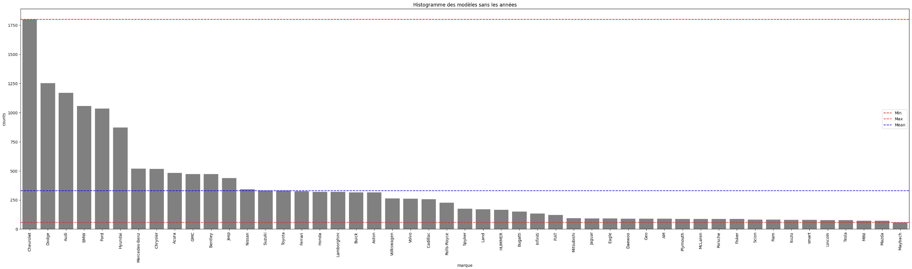

# Presentation de l’équipe

- Dans un premier nous nous sommes présenter afin de mieux nous connaitre et de bien commencer ce hackathon.
- Nous sommes donc un groupe de 5 issue de 3 école différentes.
	- Epita: 3 membres
	- AlbertSchool: 1 membre
	- ECE: 1 membre
- Chacun a ses propres compétences et peut apporter son soutient au groupe.
# Mise en place des environnements de collaboration

- Dans un premier temps nous avons décidé de faire la totalité de notre projet sur un note book afin de pouvoir coder tout en gardant un moyen de presenter et de rajouter du visuel.
- GitHub : Nous avons mis en place un repo Git qui est le moyen le plus pratique pour faire du partager de code.
	- Pour éviter d'envoyer les datas qui sont conséquentes sur le repos git nous avons opté pour ajouter au debut de notre note book un script. Celui-ci télécharge les données et les place dans un dossier data afin que l’environnement soit commun a tous.

- Slack : Un channel slack a été mis en place pour nous permettre d'échanger entre nous et de suivre les différentes consignes du challenge.

# Résolution du défi 6milarité

Pour des questions d'optimisation de temps et de difference de compétences l'équipe s'est séparée afin de pouvoir traiter en parallèle les tâches de `Data Engineering`, d'`Analyse Exploratoire` et de `Modeling (Transfer Learning)`.

## 1. Data Engineering

  
  

- **Téléchargement des données avec API Kagle de Python**: Au début du challenge, nous nous sommes rendu compte que la grosse volumétrie de nos données causait un long téléchargment. Nous avons donc cherché une solution plus rapide et nous avons découvert une API Kaggle compatible avec Python qui nous nous a permis de télécharger nos données plus rapidement.

  
  

- **Groupement des données**: Pour pouvoir obtenir les noms de modèles pour chaque donnée du train et du test set, nous avons effectué des jointures entre nos données. Ces tables jointes seront utilisées ensuite dans notre `Analyse Exploratoire`.

  
  

- **Feature Engineering**: Pour une analyse et une réflexion plus poussée et complète, nous avons crée de nouvelles variables. Ainsi, nous avons extrait l'`année` de chaque classe, le `nom du modèle sans l'année`, ainsi que la `marque`de la voiture. Nous décrirons ensuite nos données en analysant en plus ces nouvelles données.

  
  

## 2. Analyse Exploratoire des Données (EDA)

  

Cette partie nous a permis de mieux comprendre les données mises à notre disposition.

  

- **Distribution des classes**: La distribution des classes dans le test set est similaire à celle du training set. Cela signifie que le modèle sera évalué sur un ensemble de données représentatif des données réelles d'entrainement.

  

  
  

- **Distribution des classes dans l'ensemble des données**: On observe une distribution déséquilibrée, avec certaines classes plus fréquentes que d'autres. Le modèle pourrait être biaisé en faveur des classes majoritaires, ce qui signifie qu'il pourrait être plus performant pour reconnaître ces classes et moins performant pour reconnaître les classes minoritaires.

  

  

  

  

  
  
  

| Category | Top 5 | Tail 5 |

|:-----------|:-----------|:-----------|

|**Classes de voiture** | - Chevrolet Corvette ZR1 2012 - Mitsubishi Lancer Sedan 2012 - Mercedes-Benz 300-Class Convertible 1993 - Chrysler 300 SRT-8 2010 - GMC Savana Van 2012 | - Hyundai Accent Sedan 2012 - FIAT 500 Abarth 2012 - Maybach Landaulet Convertible 2012 - Chevrolet Express Cargo Van 2007 - Rolls-Royce Phantom Drophead Coupe Convertible 2012 |

|**Modèle sans les années** | - Honda Odyssey Minivan  - Audi S4 Sedan  - Ford F-150 Regular Cab  - Volkswagen Golf Hatchback  - Dodge Durango SUV | - Hyundai Accent Sedan - FIAT 500 Abarth  - Maybach Landaulet Convertible - Chevrolet Express Cargo Van - Rolls-Royce Phantom Drophead Coupe Convertible |

|**Marques des voiture** | - Ford - BMW - Audi - Dodge - Chevrolet | - Maybach - Mazda - MINI - Tesla - Lincoln |

## 3. Modeling (Transfer Learning)

- Pour commencer on a cherché ce qui a déjà été fait sur se data set. On a trouvé different résultats dont  On c'est inspiré pour créer notre propre modèle.
- Après avoir récupéré les données, nous avons rencontré un premier obstacle : notre précision ne s'améliorait pas et notre perte (loss) restait constamment à 5. Pour résoudre ce problème, nous avons tenté de modifier divers hyper paramètres, mais en vain. Notre modèle ne montrait aucun signe de convergence. Après de nombreuses discussions avec différents coachs, nous avons décidé de changer d'algorithme d'optimisation. Nous sommes donc passés de Adam à SGD. Une fois cette transition effectuée, nous avons obtenu des résultats bien plus satisfaisants.
- Suite à ce changement nous avons pu faire varié les différents hyper paramètre pour trouver les plus optimisé, on a donc trouvé:
	- après une multitude de test, $10^{-2}$ de learning rate est le plus optimal.
	- batchsize:
		- une valeur de 32 est mieux pour un dataset diviser en 50% test et 50% train.
		- une valeur de 64 est mieux pour un dataset diviser en 80% test et 20% train.
	- Au départ, les données étaient réparties à parts égales entre l'ensemble de test et l'ensemble d'entraînement. Après plusieurs essais, nous avons constaté que cette répartition initiale nous donnait les meilleurs résultats.
	- Initialement, nous avons examiné divers hyperparamètres pour normaliser les images. Cependant, après des recherches approfondies, nous avons constaté que resNet-18 effectue par défaut une normalisation similaire à celle du jeu de données sur lequel il a été préalablement entraîné, ImageNet. Ainsi, la meilleure approche était de laisser resNet-18 effectuer la normalisation pour nous. Cette constatation a conduit à une nette amélioration de nos résultats.
- Nous avons envisagé d'appliquer une pondération de classe, mais après avoir analysé les données, nous avons remarqué que les classes avaient en moyenne un nombre similaire de données, à l'exception d'une classe qui se distinguait, mais qui ne causait ni de surapprentissage ni de confusion pour notre modèle.